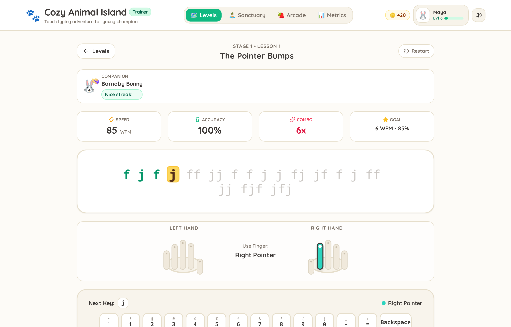
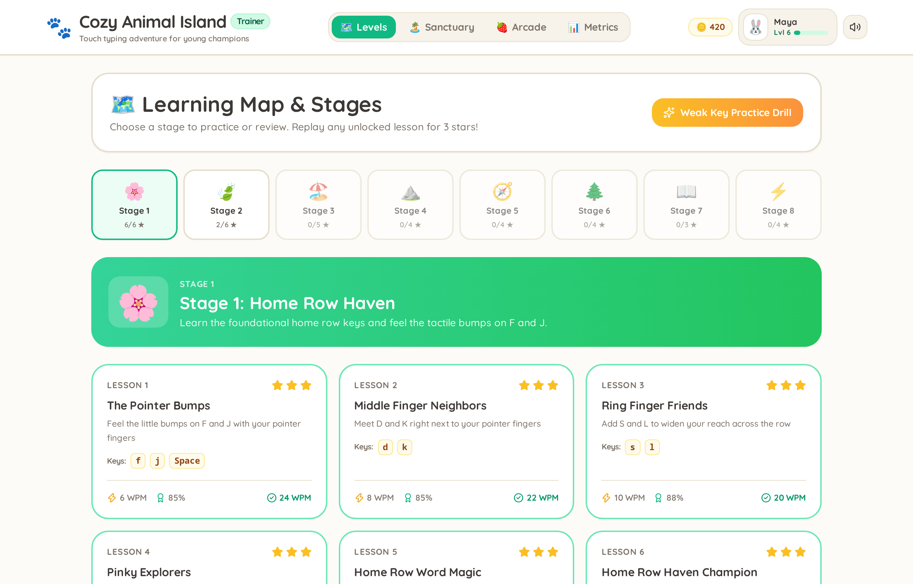
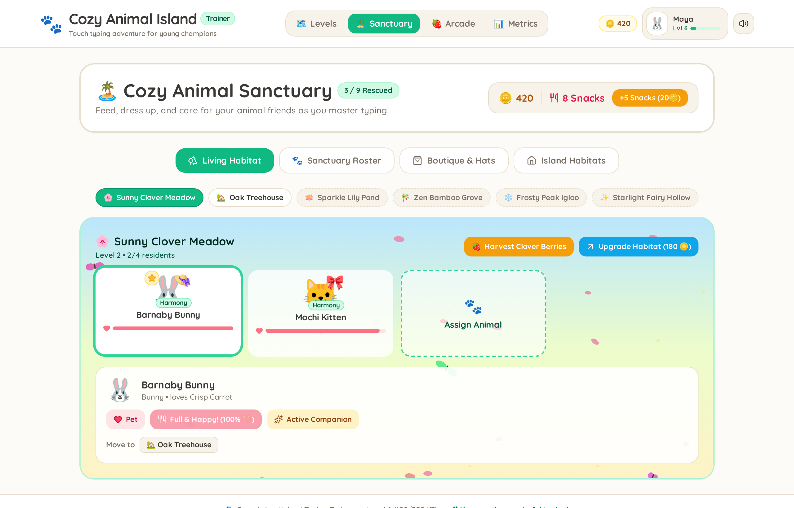
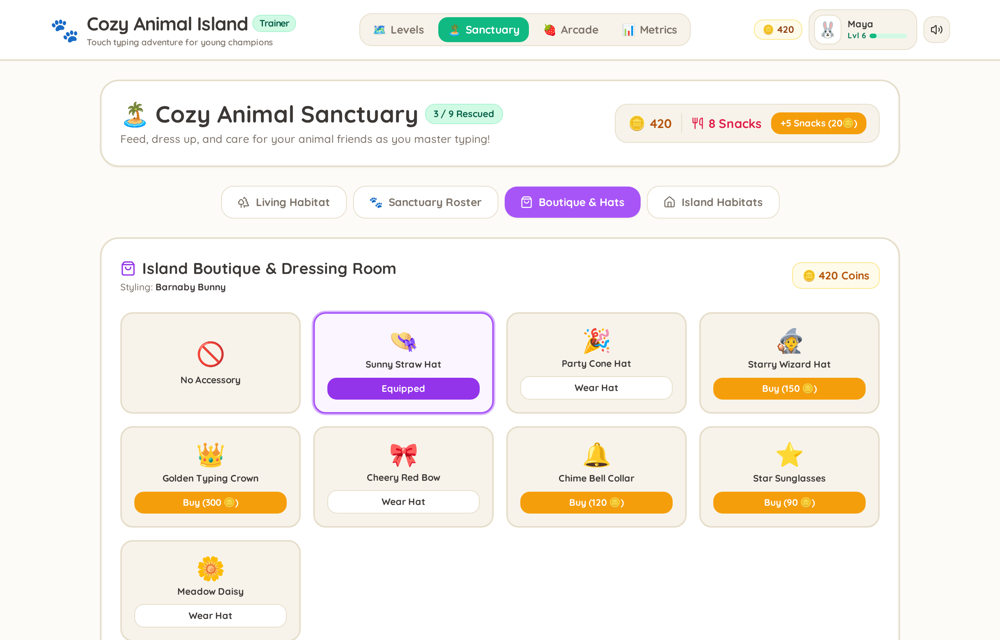
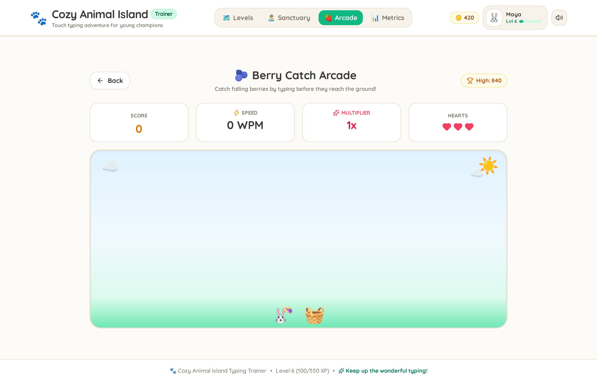
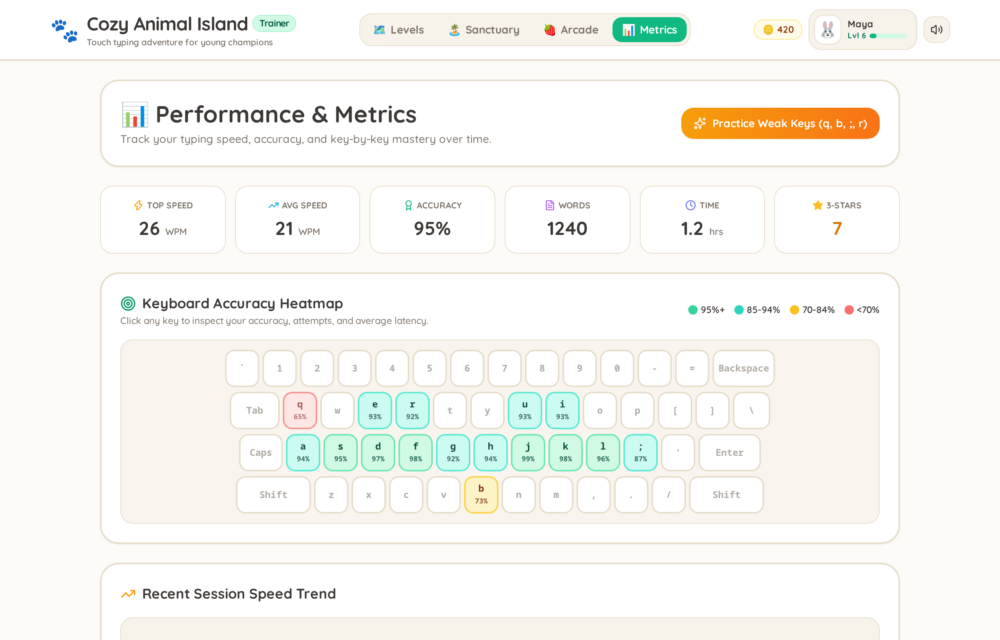
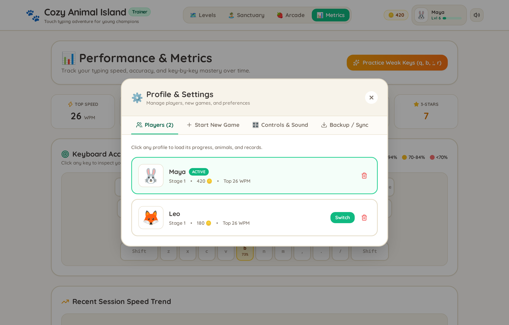

<div align="center">

# 🐾 Cozy Animal Island Typing Trainer 🏝️

### *A gentle, gamified touch-typing adventure built with love for young champions*

[](https://react.dev/)
[](https://www.typescriptlang.org/)
[](https://tailwindcss.com/)
[](https://vitejs.dev/)
[](https://vitest.dev/)
[](#-safe-private--offline-first)
[](LICENSE)

<br />



<br />

[**Key Features**](#-key-features) •
[**Origin Story**](#-built-for-my-daughter-crafted-for-kids) •
[**Curriculum**](#-8-stage-pedagogical-curriculum) •
[**Interactive Sanctuary**](#-living-animal-sanctuary--dioramas) •
[**Arcade Mode**](#-berry-catch-arcade) •
[**Analytics**](#-analytics--adaptive-weak-key-drills) •
[**Quick Start**](#-quick-start--development)

</div>

---

## 💖 Built for My Daughter, Crafted for Kids

Most typing tutors on the web fall into two extremes: dry, corporate-style drills that quickly bore young learners, or punishing, fast-paced shooting games with sudden fail screens that induce anxiety and frustration.

**Cozy Animal Island Typing Trainer** was created by a parent for their daughter to turn the journey of learning touch typing into a joyful, rewarding, and anxiety-free experience. 

Instead of pressure and harsh timers, the game surrounds kids with encouraging animal companions, cheerful sound effects, and tangible milestones. As children master home-row keys, finger placement, and typing rhythm, they rescue animal friends, cultivate vibrant island habitats, harvest crops, and customize their animal companions in cute hats!

### Core Design Principles:
- 🌸 **Zero-Anxiety Learning**: No sudden "Game Over" screens. Errors prompt gentle, constructive correction rather than punishment.
- 🖐️ **Intuitive Tactile Guidance**: Live SVG hand diagrams show the exact finger to use for every single keystroke.
- 🥕 **Positive Reinforcement**: Every key typed earns experience points (XP), gold coins, and happiness for island pets.
- 🛡️ **100% Kid-Safe & Private**: Runs entirely in the browser. Zero ads, zero trackers, zero data collection, and full offline capability.

---

## ✨ Key Features

| Feature | Description |
| :--- | :--- |
| 🖐️ **Animated Hand & Key Guides** | Real-time finger targeting with color-coded keyboard zones and home-row anchor prompts. |
| 🗺️ **8-Stage Structured Curriculum** | 40+ carefully paced lessons progressing from pointer bumps (`F` & `J`) to full storybook sprints. |
| 🏝️ **Living Animal Sanctuary** | Rescue 9 unique animal friends across 6 animated biomes featuring canvas particle engines. |
| 👒 **Boutique & Dressing Room** | Dress up animal companions with hats, bows, crowns, wizard caps, and flower accessories. |
| 🍓 **Berry Catch Arcade** | Dynamic mini-game testing typing reflexes with falling fruit words and combo multipliers. |
| 📊 **Heatmap & Weak-Key Drills** | Per-key accuracy analytics that automatically generate targeted practice drills for struggling letters. |
| 👨‍👩‍👧 **Multi-Child Profiles** | Separate profiles for siblings with custom avatars, independent progress, and 1-click JSON backup. |
| 🎵 **Tactile Web Audio Synthesizer** | Cheerful, zero-latency custom synthesized key clicks, chimes, and celebration fanfares. |

---

## 🎮 Visual Tour & Gameplay

### 1. Interactive Typing Arena
The heart of the learning experience. Children are never left guessing which finger strikes which key.

<div align="center">
  
</div>

- **Interactive Hand Guide**: High-contrast, friendly hand illustrations highlight the left or right hand and the specific finger needed (*"Use Finger: Right Pointer"*).
- **Virtual Keyboard with Finger Zones**: Color-coded key zones (pinkies, ring, middle, index, and thumbs) guide correct posture.
- **Active Companion Cheer**: The child's chosen animal companion sits by their side, cheering streaks with reactive emotions and awarding bonus XP.
- **Configurable Strict Mode**: Toggle strict backspacing to ensure errors are corrected before moving forward.

---

### 2. The 8-Stage Learning Map
A complete, structured curriculum that gradually expands a child's comfort zone from tactile home-row bumps to fluid writing.

<div align="center">
  
</div>

- **3-Star Mastery System**: Kids are encouraged to revisit earlier lessons to improve their speed and accuracy.
- **Milestone Animal Unlocks**: Rescuing new animals (like Mochi Kitten or Rusty Fox) provides a magical milestone at the end of each stage.
- **Adaptive Practice Drills**: A dedicated "Weak Key Practice Drill" button is always available to reinforce trouble spots.

---

### 3. Living Animal Sanctuary & Dioramas
The rewards earned from typing lessons come to life in the Sanctuary!

<div align="center">
  
</div>

- **6 Unique Biomes**: Sunny Clover Meadow, Oak Treehouse, Sparkle Lily Pond, Zen Bamboo Grove, Frosty Peak Igloo, and Starlight Fairy Hollow.
- **Living Particle Canvas Engine**: Watch floating flower petals, gentle snow flurries, glowing fireflies, and bubbles float across the screen.
- **Care & Feeding Loop**: Harvest renewable crops (Clover Berries, Acorns, Lily Nectar) and feed healthy snacks to raise animal happiness to 100%.
- **Habitat Upgrades**: Expand habitat capacity and earn harvest bonuses as habitats level up.

---

### 4. Boutique & Dressing Room
A playful incentive where kids spend their hard-earned typing coins!

<div align="center">
  
</div>

- Equip companions with whimsical hats: **Sunny Straw Hat** 👒, **Party Cone Hat** 🎉, **Starry Wizard Hat** 🧙, **Golden Typing Crown** 👑, **Cheery Red Bow** 🎀, and **Star Sunglasses** ⭐.
- Equipped cosmetics appear directly on your companion across the Sanctuary, Typing Arena, and Arcade!

---

### 5. Berry Catch Arcade
When practice calls for a change of pace, the Arcade offers exciting action!

<div align="center">
  
</div>

- **Dynamic Falling Words**: Type the words on descending berries (strawberries, blueberries, cherries) before they hit the grass.
- **3 Kid-Friendly Speeds**: *Sunny Orchard* (15–35 WPM), *River Rapids* (40–70 WPM), and *Mastery Rush* (70–100+ WPM).
- **Streak Multipliers**: Maintain combos to rack up high scores and rescue Ollie the Otter!

---

### 6. Analytics & Adaptive Weak-Key Drills
Empowering parents and kids to pinpoint trouble spots without tedious manual testing.

<div align="center">
  
</div>

- **Keyboard Accuracy Heatmap**: Visual color brackets immediately spotlight keys:
  - 🟩 **Mastered** (95%+ accuracy)
  - 🟦 **Great** (85%–94% accuracy)
  - 🟨 **Needs Practice** (70%–84% accuracy)
  - 🟥 **Critical Focus** (<70% accuracy)
- **1-Click Smart Drills**: Click **"Practice Weak Keys"** to instantly generate an adaptive drill focused on the student's unique error keys.
- **Historical Progress Charts**: Track speed (WPM) and accuracy growth across sessions.

---

### 7. Multi-Player Profile Manager
Perfect for families, classrooms, or homeschool setups with multiple children.

<div align="center">
  
</div>

- **Instant Switching**: Create separate profiles for each child with their favorite animal avatar.
- **Customizable Experience**: Adjust sound volume, toggle hand guides, and configure font sizes.
- **Backup & Sync**: 1-click JSON export and import makes it effortless to save progress or transfer to another computer.

---

## 📚 8-Stage Pedagogical Curriculum

The curriculum follows established touch-typing pedagogy tailored for young learners:

```
[Stage 1: Home Row Haven]       --> Anchor tactile bumps (F, J) & neighboring home keys
          ↓
[Stage 2: Top Row Treks]        --> Upward pointer & middle reaches (E, I, R, U, T, Y, W, O, Q, P)
          ↓
[Stage 3: Bottom Row Beach]     --> Downward reaches & dexterity (V, M, C, Comma, X, Period, Z, B, N)
          ↓
[Stage 4: Capital Cliffs]       --> Shift key coordination (Left Shift & Right Shift)
          ↓
[Stage 5: Number Safari]        --> Reaching the top number row & essential punctuation (!, ?, ')
          ↓
[Stage 6: Sight Word Woods]     --> Muscle memory for high-frequency early reader vocabulary
          ↓
[Stage 7: Storybook Shire]      --> Flow & rhythm practice with charming animal micro-stories
          ↓
[Stage 8: 100+ WPM Mastery]     --> Speed sprints & rhythm endurance challenges
```

| Stage | Name | Key Focus | Milestone Unlock |
| :---: | :--- | :--- | :---: |
| **1** | **Home Row Haven** | `F`, `J`, `D`, `K`, `S`, `L`, `A`, `;`, `H`, `G`, Space | 🐱 Mochi Kitten |
| **2** | **Top Row Treks** | `R`, `U`, `E`, `I`, `T`, `Y`, `W`, `O`, `Q`, `P` | 🦊 Rusty Fox |
| **3** | **Bottom Row Beach** | `V`, `M`, `C`, `,`, `X`, `.`, `Z`, `/`, `B`, `N` | 🐼 Bao Bao Panda |
| **4** | **Capital Cliffs** | Left Shift, Right Shift, proper Capitalization | 🐧 Pip Penguin |
| **5** | **Number & Symbol Safari** | Numbers `1`–`0`, quotes, exclamation, question marks | 🦉 Professor Hoot |
| **6** | **Sight Word Woods** | Common phonetic words & sight vocabulary | 🦫 Cappy Capybara |
| **7** | **Storybook Shire** | Punctuation flow, sentence rhythm, story reading | 🌸 Meadow Master |
| **8** | **100+ WPM Mastery Rush** | Advanced speed bursts, fluency, and endurance | 🐲 Sparky Baby Dragon |

---

## 🖐️ Finger Placement Guide

The application uses an intuitive, color-coded finger mapping system:

| Finger | Left Hand Keys | Right Hand Keys |
| :--- | :--- | :--- |
| **Pinky** 🌸 | `Q`, `A`, `Z`, `Left Shift`, `Tab` | `P`, `;`, `/`, `Right Shift`, `Enter`, `-`, `=` |
| **Ring** 🌿 | `W`, `S`, `X` | `O`, `L`, `.` |
| **Middle** ☀️ | `E`, `D`, `C` | `I`, `K`, `,` |
| **Pointer** 💧 | `R`, `T`, `F`, `G`, `V`, `B` | `Y`, `U`, `H`, `J`, `N`, `M` |
| **Thumbs** 🐾 | `Spacebar` | `Spacebar` |

---

## 🛠️ Tech Stack & Architecture

This project is built using a modern, zero-bloat web development stack:

- **Frontend Framework**: [React 19](https://react.dev/) (Functional components, hooks, high responsiveness)
- **Language**: [TypeScript 5.8](https://www.typescriptlang.org/) (Strict typing across game models, profiles, and state machines)
- **Styling**: [Tailwind CSS 3.4](https://tailwindcss.com/) with a custom cozy pastel theme
- **Icons**: [Lucide React](https://lucide.dev/)
- **Visual FX**: [Canvas Confetti](https://github.com/catdad/canvas-confetti) + Custom HTML5 Canvas Particle Engine
- **Audio Engine**: Zero-asset Web Audio API Synthesizer (custom oscillators for key clicks, level-up fanfares, and chimes)
- **Unit Testing**: [Vitest 3](https://vitest.dev/) + [@testing-library/react](https://testing-library.com/)
- **End-to-End Testing & Screenshots**: [Playwright 1.63](https://playwright.dev/)
- **Bundler & Dev Server**: [Vite 6](https://vitejs.dev/)

### Directory Structure

```text
typing-trainer/
├── docs/
│   └── screenshots/          # Showcase PNG images for GitHub README
├── e2e/
│   ├── typing-trainer.spec.ts        # Comprehensive Playwright user journey tests
│   └── generate-screenshots.spec.ts  # Automated high-res screenshot capture
├── src/
│   ├── audio/                # Web Audio API sound synthesizer
│   ├── components/
│   │   ├── arcade/           # Berry Catch mini-game
│   │   ├── game/             # TypingArena, LevelSelect, Companion widgets
│   │   ├── island/           # Living habitat diorama, particle canvas, sprites
│   │   ├── keyboard/         # VirtualKeyboard, HandGuide, layout definitions
│   │   ├── metrics/          # Performance charts & keyboard accuracy heatmap
│   │   └── profile/          # Multi-user profile management & data backups
│   ├── curriculum/           # 8-stage lesson definitions & dynamic drill generator
│   ├── engine/               # Touch-typing input engine & real-time metrics hook
│   ├── island/               # Island progression, cosmetics, and habitat actions
│   ├── storage/              # Local-first persistence, migrations, and default state
│   ├── types/                # TypeScript domain models (Curriculum, Island, Profile)
│   ├── App.tsx               # Main application controller
│   └── main.tsx              # React DOM entry point
├── playwright.config.ts      # Playwright test & screenshot config
├── vite.config.ts            # Vite build & Vitest test config
└── package.json
```

---

## 🚀 Quick Start & Development

### Prerequisites
- [Node.js](https://nodejs.org/) (v18.0.0 or higher recommended)
- `npm` (comes with Node)

### Installation

1. **Clone the repository**:
   ```bash
   git clone https://github.com/schmidtj/Typing_Trainer.git
   cd Typing_Trainer
   ```

2. **Install dependencies**:
   ```bash
   npm install
   ```

3. **Start the local development server**:
   ```bash
   npm run dev
   ```
   Open your browser and navigate to:
   ```
   http://localhost:3080
   ```

### Production Build

```bash
# Typecheck and bundle for production
npm run build

# Preview production build locally
npm run preview
```

---

## 🧪 Testing Suite

The project features comprehensive automated test coverage for core typing mechanics, state management, and end-to-end user flows.

### Running Unit Tests (Vitest)
```bash
npm test
```

### Running End-to-End Tests (Playwright)
```bash
npm run test:e2e
```

### Regenerating README Screenshots
To re-capture all high-resolution showcase screenshots:
```bash
npx playwright test e2e/generate-screenshots.spec.ts
```

---

## 🛡️ Safe, Private, & Offline-First

Parents and educators can feel 100% confident letting kids explore on their own:
- 🔒 **Zero Data Collection**: We don't collect names, email addresses, analytics, or keystrokes.
- 🚫 **No Advertisements or In-App Purchases**: All cosmetics, snacks, and habitats are unlocked solely with coins earned through honest typing practice.
- 💾 **Local-First Storage**: All progress is stored in the browser's `localStorage`.
- ✈️ **Fully Offline Capable**: Works without an active internet connection after initial page load.

---

## 🤝 Contributing

Contributions, feedback, and suggestions from fellow parents, teachers, and developers are warmly welcomed!

1. Fork the Project
2. Create your Feature Branch (`git checkout -b feature/AmazingFeature`)
3. Commit your Changes (`git commit -m 'feat: Add cute new animal companion'`)
4. Push to the Branch (`git push origin feature/AmazingFeature`)
5. Open a Pull Request

---

## 📄 License

Distributed under the **MIT License**. See `LICENSE` for more information.

---

<div align="center">

🐾 *Dedicated to young typists everywhere — may your keystrokes be light and your adventures joyful!* 🌸

</div>
